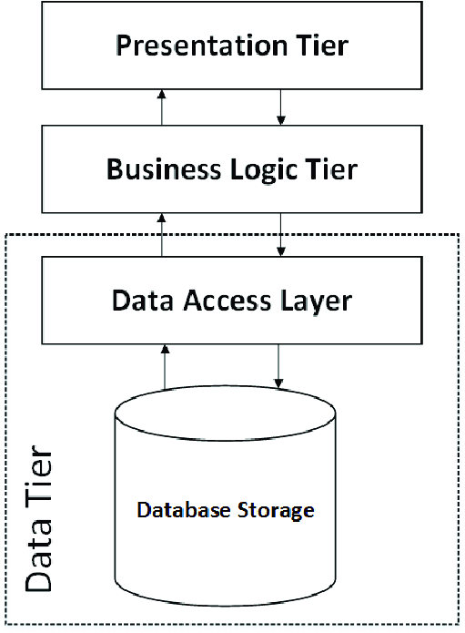
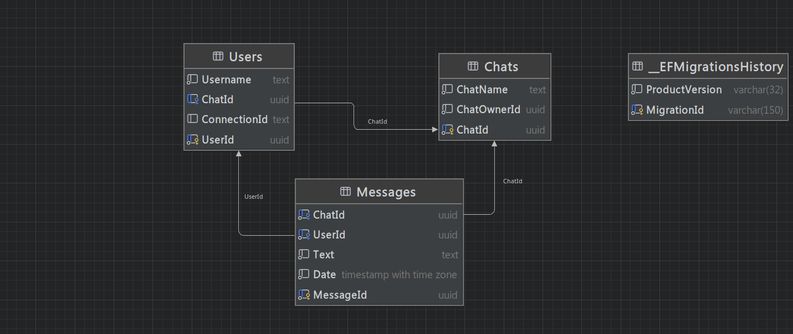

# Table of Contents
1. [Overview📖](#overview)
2. [Technologies🛠️](#technologies)
3. [Architecture📐](#architecture)
4. [Other Patterns and Principles📚](#other-patterns-and-principles)
    - [Mediator](#mediator)
    - [CQRS](#cqrs)
    - [Generic Repository](#generic-repository)
    - [Result](#result)
5. [Database Schema📊](#database-schema)
6. [How to run🏗️](#how-to-run)

# Overview📖
This project is a real-time chat application built using .NET with SignalR, allowing users to create, search, connect to, and delete chats. Users can communicate in real-time within these chats, sending messages visible to all participants.
# Technologies🛠️

- [ASP.NET 8](https://dotnet.microsoft.com/en-us/apps/aspnet)
- [SignalR](https://learn.microsoft.com/en-us/aspnet/signalr/overview/getting-started/introduction-to-signalr) - for implementing websocket connection between server and client.
- [MediatR](https://github.com/jbogard/MediatR) - for implementing Mediator pattern.
- [Entity Framework Core](https://github.com/dotnet/efcore) - ORM
- [Mapster](https://github.com/MapsterMapper/Mapster) - for mapping between entities and DTOs.
- [xUnit](https://github.com/xunit/xunit) - for unit testing.
- [NSubstitue](https://nsubstitute.github.io/) - for isolating dependencies in unit tests.

# Architecture📐

In our application's backend, we are using a 3-tier architecture model, which promotes clear separation of concerns and scalability. The system architecture is organized into three main tiers: Presentation/UI, Business Logic, and Data Access layers.

<div align="center">

</div>

## Presentation/UI Layer 
This layer handles user interaction and presentation logic. It includes components responsible for rendering the user interface and receiving user inputs. In our application, this layer may consist of controllers, views, or user interface components depending on the technology stack used. 

## Business Logic Layer 
Also known as the Application Layer, this tier encapsulates the core business logic and rules of our application. It serves as an intermediary between the presentation layer and the data access layer. Here, we implement services, workflows, and use cases that orchestrate how data is processed and business operations are executed. This layer ensures that business rules are applied consistently across different use cases and scenarios. 

## Data Access Layer 
The Data Access Layer (DAL) manages the storage and retrieval of data from various data sources, such as databases or external APIs. It abstracts the underlying data storage implementation details from the rest of the application layers. In our setup, this layer includes repositories or data access components responsible for CRUD operations, querying data, and interacting with the database or data storage services.
This 3-tier architecture model enhances maintainability, scalability, and separation of concerns within our application backend, facilitating easier testing, debugging, and future enhancements.

# Other patterns and principles📚
Our system incorporates various patterns and principles to enhance architecture, modularity, and maintainability:

## Mediator
Mediator provides a simple and elegant way to implement communication between different components of a system without directly coupling them together. In this pattern, each component sends messages to a mediator, which then distributes those messages to other components that have registered to handle them. This approach allows for a decoupled and loosely coupled architecture, where components do not need to know about each other's existence, promoting scalability and maintainability. Overall, MediatR promotes the Single Responsibility Principle (SRP) and enhances the modularity and testability of the system.

## CQRS
CQRS (Command Query Responsibility Segregation) design pattern separates the operations that modify state from those that read state in a system. This separation allows for different optimizations and scaling strategies for the two types of operations. In a CQRS architecture, commands represent actions that change the state of the system, while queries represent requests for information about the system's current state. By separating these concerns, a CQRS system can be optimized for both high write throughput and fast query performance. However, implementing a CQRS architecture can be complex and may require significant changes to existing systems.

## Generic Repository
The Generic Repository pattern provides a standardized interface for data access operations. It allows for generic implementations of common data access methods, promoting code reusability and consistency in data interactions. The Generic Repository pattern simplifies the data access layer by providing a uniform API for various entities within the application.

## Result
The Result pattern enhances error handling and response generation in an application. It provides a structured way to handle success and failure scenarios, allowing for better communication of outcomes between components. The Result pattern contributes to the overall robustness of the system by promoting clear and consistent handling of results.
These patterns collectively contribute to a well-architected system, promoting modularity, testability, and maintainability in software development.
## Mediator
Mediator provides a simple and elegant way to implement communication between different components of a system without directly coupling them together. In this pattern, each component sends messages to a mediator, which then distributes those messages to other components that have registered to handle them. This approach allows for a decoupled and loosely coupled architecture, where components do not need to know about each other's existence, promoting scalability and maintainability. Overall, MediatR promotes the Single Responsibility Principle (SRP) and enhances the modularity and testability of the system.

## CQRS
CQRS (Command Query Responsibility Segregation) design pattern separates the operations that modify state from those that read state in a system. This separation allows for different optimizations and scaling strategies for the two types of operations. In a CQRS architecture, commands represent actions that change the state of the system, while queries represent requests for information about the system's current state. By separating these concerns, a CQRS system can be optimized for both high write throughput and fast query performance. However, implementing a CQRS architecture can be complex and may require significant changes to existing systems.

## Generic Repository
The Generic Repository pattern provides a standardized interface for data access operations. It allows for generic implementations of common data access methods, promoting code reusability and consistency in data interactions. The Generic Repository pattern simplifies the data access layer by providing a uniform API for various entities within the application.

## Result
The Result pattern enhances error handling and response generation in an application. It provides a structured way to handle success and failure scenarios, allowing for better communication of outcomes between components. The Result pattern contributes to the overall robustness of the system by promoting clear and consistent handling of results.
These patterns collectively contribute to a well-architected system, promoting modularity, testability, and maintainability in software development.

# Database Schema📊
Check out the schema diagram below to see how tables are organized and connected.



# How to run🏗️
This section provides step-by-step instructions for launching this application using Docker Compose for managing containers.

1. Clone the Repository:
```bash
   git clone https://github.com/ilyam3004/ChatApplication.git
   cd ChatApplication
```

2. Set the connection string for your PostgreSQL Database in [docker-compose.yml](https://github.com/ilyam3004/ChatApplication/blob/d379c89aa5c957a5cb7c3ee95820143a5f99fa00/docker-compose.yml#L13) file. The database schema will be configured automatically when you run the application:
```yml
   environment:
      - ConnectionStrings__DefaultConnection={{YOUR_CONNECTION_STRING}}
```

3. Then run docker-desktop and build docker images:
```bash
docker-compose build
```

4. Run docker containers:
```bash
docker-compose up
```

5. Access the application using [Postman](https://www.postman.com/) or another tool:

For websocket connection:
```js
ws://localhost:8181/chathub 
```

For api controllers:
```js
http://localhost:8181/<path>
```

Let's create create the user first:

```json
POST http://localhost:8181/users
{
	"Username": "chat_user"
}
```

The response:

```json
200 OK
{
	"userId": "039ec506-5f6b-4f0a-b427-7e9bdc8113fe",
	"username": "chat_user"
}
```

Then let's get all chats:
```json
GET http://localhost:8181/chats
```

As we can see there is no chats now:
```json
200 OK
[]
```

Let's create one:
```json
POST http://localhost:8181/chats
{
	"UserId": "039ec506-5f6b-4f0a-b427-7e9bdc8113fe",
	"ChatName": "chat"
}
```

Response:
```json
200 OK
{
	"chatId": "e209a4ac-4ed7-4068-9728-cc1a1a8181bd",
	"chatOwnerId": "039ec506-5f6b-4f0a-b427-7e9bdc8113fe",
	"chatName": "chat"
}
```

We can seach for chats also. Let's try with the query "ch". This will seach for all chats whih contains "ch":
```json
GET http://localhost:8181/chats/ch
```

As we can see there is only our chat that contains "ch":
```json
200 OK
[
    {
        "chatId": "e209a4ac-4ed7-4068-9728-cc1a1a8181bd",
        "chatOwnerId": "039ec506-5f6b-4f0a-b427-7e9bdc8113fe",
        "chatName": "chat"
    }
]
```

Then lets create the websocket connection and connect to our new chat. Let's connect to this address and send the handshake request: 
```json
ws://localhost:8181/chat-hub
{
    "protocol": "json",
    "version": 1
}
```

To connect to our chat let's make this request:
```json
{
    "type": 1,
    "target": "JoinChat",
    "arguments": [
        {
            "UserId": "039ec506-5f6b-4f0a-b427-7e9bdc8113fe",
            "ChatId": "e209a4ac-4ed7-4068-9728-cc1a1a8181bd"
        }
    ]
}
```

When a user joins the chat, he will receive the list of all messages from the chat. The other members will receive just one message notifying them that someone has joined the chat:
```json
{
    "type": 1,
    "target": "ReceiveMessage",
    "arguments": [
        [
            {
                "userName": "chat_user",
                "message": "chat_user joined the chat.",
                "date": "2024-07-12T20:04:53.7788358Z"
            }
        ]
    ]
}
```

Let't create one more user and connect to the same chat:
```json
{
    "type": 1,
    "target": "JoinChat",
    "arguments": [
        {
            "UserId": "85c660b7-cbd8-49e8-94be-da6eb516f278",
            "ChatId": "e209a4ac-4ed7-4068-9728-cc1a1a8181bd"
        }
    ]
}
```

As we can see second user received the response with all messages from this chat:
```json
{
    "type": 1,
    "target": "ReceiveMessage",
    "arguments": [
        [
            {
                "userName": "chat_user",
                "message": "chat_user joined the chat.",
                "date": "2024-07-12T20:04:53.778835Z"
            },
            {
                "userName": "ilya_3004",
                "message": "ilya_3004 joined the chat.",
                "date": "2024-07-12T20:07:01.1826203Z"
            }
        ]
    ]
}
```

And the first user received the message that the second user has joined the chat:
```json
{
    "type": 1,
    "target": "ReceiveMessage",
    "arguments": [
        {
            "userName": "ilya_3004",
            "message": "ilya_3004 joined the chat.",
            "date": "2024-07-12T20:07:01.1826203Z"
        }
    ]
}
```

Let't try to send the message:
```json
{
    "type": 1,
    "target": "SendMessageToChat",
    "arguments": [
        {
            "UserId": "039ec506-5f6b-4f0a-b427-7e9bdc8113fe",
            "Message": "Some text to test sending messages."
        }
    ]
}
```

All users in chat got this response:
```json
{
    "type": 1,
    "target": "ReceiveMessage",
    "arguments": [
        {
            "userName": "chat_user",
            "message": "Some text to test sending messages.",
            "date": "2024-07-12T20:08:37.6246415Z"
        }
    ]
}
```

Let's try to delete the chat as a user who is not the creator of the chat.

```json
DELETE http://localhost:8181/chats/
{
	"UserId": "85c660b7-cbd8-49e8-94be-da6eb516f278",
	"ChatId": "e209a4ac-4ed7-4068-9728-cc1a1a8181bd"
}
```

Response:

```json
{
    "type": "https://tools.ietf.org/html/rfc9110#section-15.5.2",
    "title": "You have no permission to delete this chat because you are not an owner.",
    "status": 401,
    "traceId": "00-dddbf31c0c11d1e2d9bf5115f0b3037f-d806b105af31e086-00"
}
```

Then we will try send a DELETE request with chat creator userId:

```json
DELETE http://localhost:8181/chats/
{
	"UserId": "039ec506-5f6b-4f0a-b427-7e9bdc8113fe",
	"ChatId": "e209a4ac-4ed7-4068-9728-cc1a1a8181bd"
}
```

Response:

```json
{
    "message": "Chat e209a4ac-4ed7-4068-9728-cc1a1a8181bd deleted succesfully"
}
```


And as we can see all members of this chat received the message that they were disconnected from this chat:
```json
{
    "type": 1,
    "target": "You have been disconnected from the chat e209a4ac-4ed7-4068-9728-cc1a1a8181bd because the root deleted it",
    "arguments": []
}
```

To stop the application and remove containers run this:

```bash
docker-compose down
```